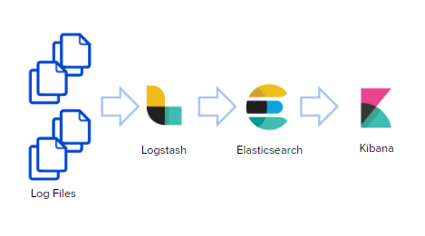

# ELK  Docker

[](https://hub.docker.com/r/scalified/elk)
[](https://microbadger.com/images/scalified/elk)
[](https://microbadger.com/images/scalified/elk)

## Description

This repository is used for building a [**Docker**](https://www.docker.com) image containing [*ELK Stack**](https://www.elastic.co/elk-stack)

### ELK

ELK consists of three independent products:

• **Elasticsearch** is a distributed, JSON-based search and analytics engine, that allows us to  store the data and search

• **Logstash** is a server-side data processing pipeline that gather data, transforms it, and then sends it to Elasticsearch

• **Kibana** used to visualize Elasticsearch data and navigate the Elastic Stack



## Dockerhub

**`docker pull scalified/elk`**

## Version

| #      | Version |
|--------|---------|
| ELK    | 6.1.2   |

## Volumes

**`/var/lib/elasticsearch`**

## Ports

| Port | Description              |
|------|--------------------------|
| 4560 | Syslog Logstash Listener |
| 5044 | Beats Listener           |
| 5601 | Kibana Web               |
| 9200 | Elasticsearch REST       |
| 9300 | Elasticsearch Internal   |

### How-To

#### JBoss Logger Configuration Example

```
<custom-handler name="SYSLOG" class="org.jboss.logmanager.handlers.SyslogHandler" module="org.jboss.logmanager">
	<formatter>
		<pattern-formatter pattern="%-5p %s%E%n"/>
	</formatter>
	<properties>
		<property name="appName" value="app"/>
		<property name="facility" value="SYSLOGD"/>
		<property name="serverHostname" value="elk"/>
		<property name="port" value="4560"/>
		<property name="hostname" value="dev"/>
		<property name="syslogType" value="RFC5424"/>
	</properties>
</custom-handler>
<root-logger>
	<level name="INFO"/>
	<handlers>
		<handler name="SYSLOG"/>
	</handlers>
</root-logger>
```

#### Building Docker Image

`docker build . -t <tag>`

#### Running Docker Image

* Pulling from **Dockerhub** and launching:  
  `docker run -it scalified/elk /bin/bash`

* Launching the built image with <tag> tag:  
  `docker run -it <tag> /bin/sh`

## Scalified Links

* [Scalified](http://www.scalified.com)
* [Scalified Official Facebook Page](https://www.facebook.com/scalified)
* <a href="mailto:info@scalified.com?subject=[Alpine Supervisor Docker Image]: Proposals And Suggestions">Scalified Support</a>

